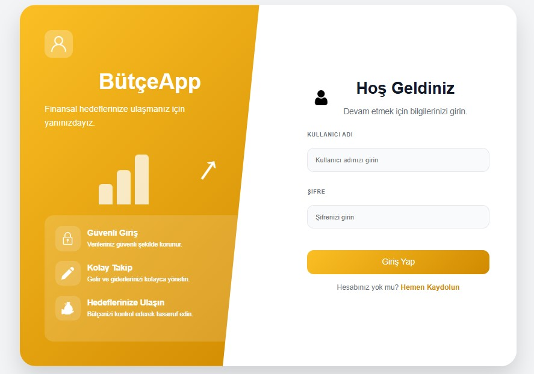
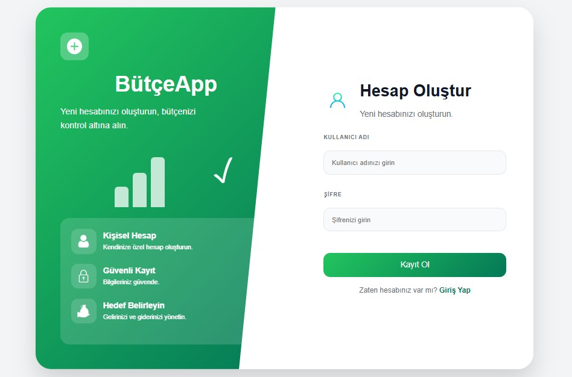
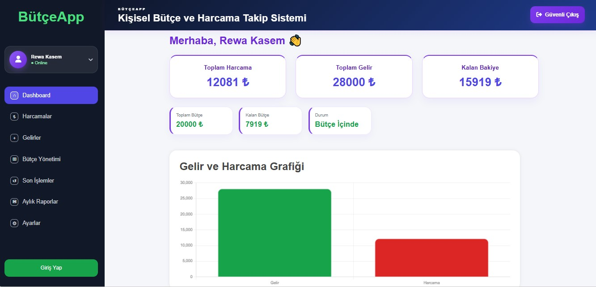
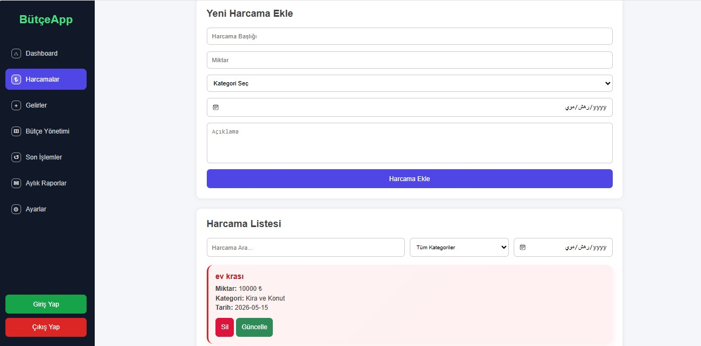
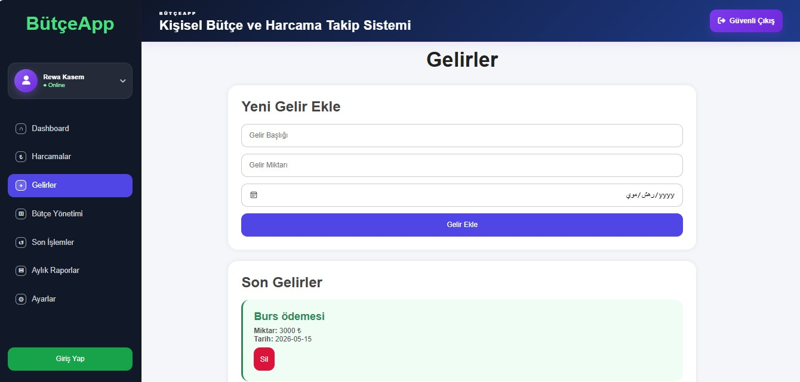
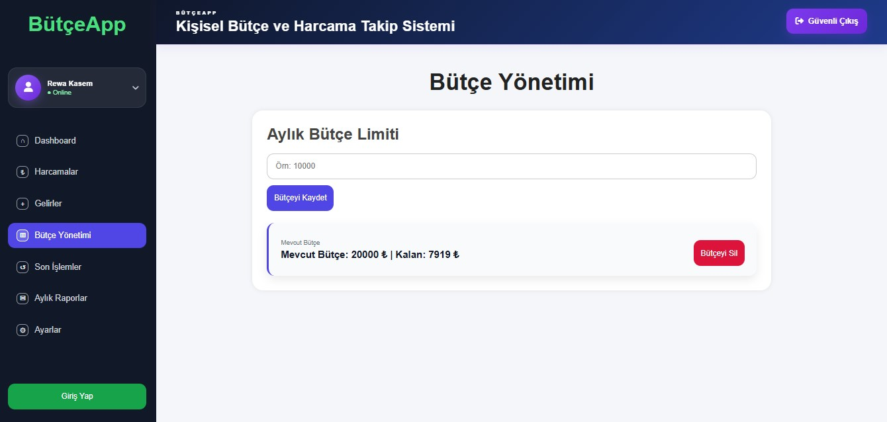
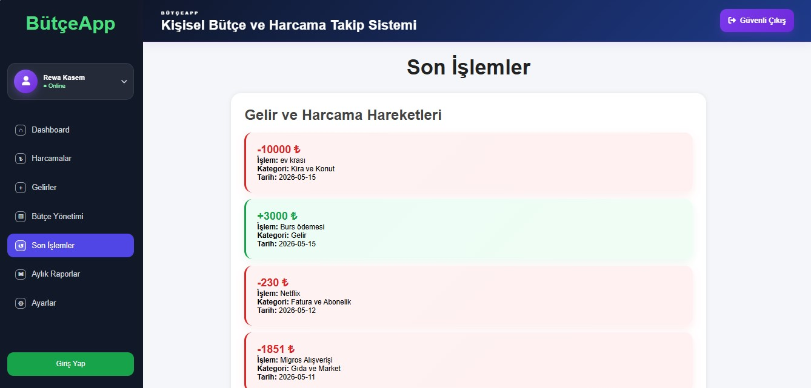
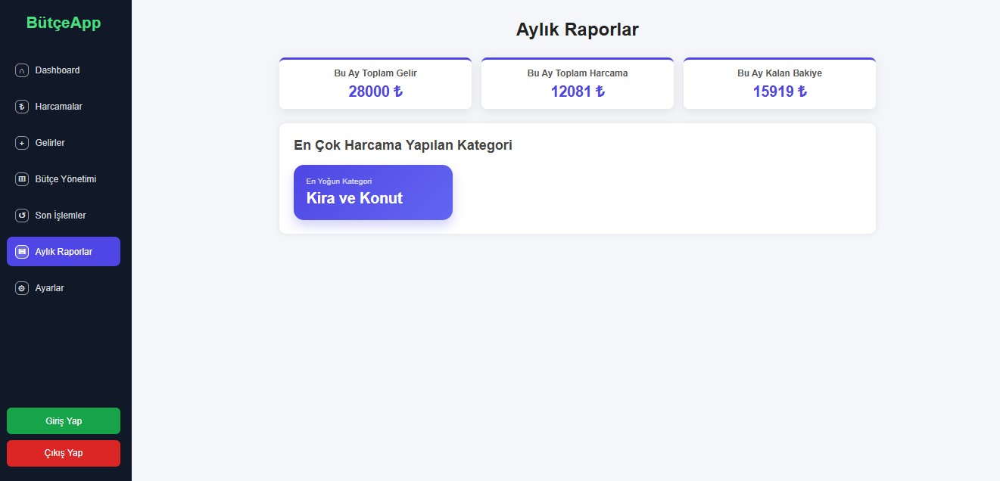
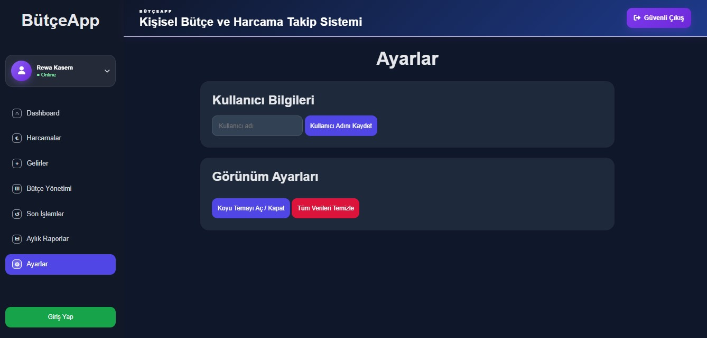
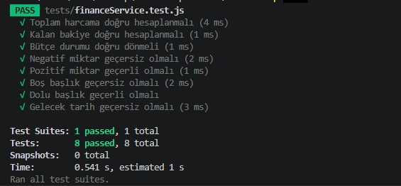

# Kişisel Bütçe ve Harcama Takip Sistemi

Bu proje, Sistem Analizi ve Tasarımı dersi kapsamında geliştirilmiş web tabanlı bir kişisel bütçe ve harcama takip sistemidir. Uygulama, kullanıcıların gelir ve giderlerini yönetmesini, bütçe durumlarını takip etmesini ve aylık finansal özetlerini görüntülemesini sağlar.

Proje; kullanıcı kayıt/giriş sistemi, JWT tabanlı kimlik doğrulama, kullanıcıya özel veri yönetimi, CRUD işlemleri, RESTful API yapısı, Swagger API dokümantasyonu ve unit test desteği içermektedir.

---

## Proje Amacı

Bu sistemin temel amacı, kullanıcıların kişisel finansal hareketlerini düzenli şekilde takip edebilmesini sağlamaktır.

Kullanıcılar sistem üzerinden:

- Gelir kayıtlarını oluşturabilir ve görüntüleyebilir.
- Harcama kayıtlarını oluşturabilir, güncelleyebilir, silebilir ve filtreleyebilir.
- Aylık bütçe limiti belirleyebilir.
- Toplam gelir, toplam harcama ve kalan bakiye bilgilerini görüntüleyebilir.
- Son finansal hareketlerini takip edebilir.
- Aylık raporlar üzerinden finansal durum analizi yapabilir.

---

## Kullanılan Teknolojiler

### Frontend

- HTML5
- CSS3
- Vanilla JavaScript
- Fetch API
- LocalStorage

### Backend

- Node.js
- Express.js
- RESTful API

### Veritabanı

- SQLite

### Kimlik Doğrulama ve Güvenlik

- JWT Authentication
- bcryptjs ile şifreleme
- Kullanıcıya özel veri erişimi

### Dokümantasyon ve Test

- Swagger UI
- Jest Unit Test
- Nodemon

---

## Temel Özellikler

### Kullanıcı Sistemi

- Yeni kullanıcı kaydı yapılabilir.
- Kayıtlı kullanıcı sisteme giriş yapabilir.
- Şifreler bcryptjs ile hashlenerek saklanır.
- Giriş işlemi sonrasında JWT token oluşturulur.
- Gelir ve harcama kayıtları kullanıcıya özel tutulur.
- Bir kullanıcı başka bir kullanıcının verilerini görüntüleyemez veya silemez.

### Dashboard

- Toplam gelir bilgisi görüntülenir.
- Toplam harcama bilgisi görüntülenir.
- Kalan bakiye hesaplanır.
- Bütçe durumu gösterilir.

### Harcama Yönetimi

- Harcama ekleme
- Harcama güncelleme
- Harcama silme
- Harcama listeleme
- Kategoriye göre filtreleme
- Tarihe göre filtreleme
- Başlığa göre arama

### Gelir Yönetimi

- Gelir ekleme
- Gelir silme
- Gelir listeleme

### Bütçe Yönetimi

- Aylık bütçe limiti belirleme
- Kalan bütçe hesaplama
- Bütçe aşımı kontrolü
- Bütçe bilgisini silme

### Son İşlemler

- Gelir ve harcama hareketleri tek bir ekranda listelenir.
- Gelirler ve harcamalar farklı renklerle gösterilir.

### Aylık Raporlar

- Bu ayki toplam gelir hesaplanır.
- Bu ayki toplam harcama hesaplanır.
- Bu ayki kalan bakiye hesaplanır.
- En çok harcama yapılan kategori görüntülenir.

### Ayarlar

- Kullanıcı adı güncellenebilir.
- Koyu tema desteği bulunur.
- Kullanıcı kendi verilerini temizleyebilir.

---

## Proje Mimarisi

Proje frontend ve backend olmak üzere iki ana bölümden oluşmaktadır.

```text
ButceTakipSistemi
│
├── backend
│   ├── services
│   │   └── financeService.js
│   ├── tests
│   │   └── financeService.test.js
│   ├── database.js
│   ├── server.js
│   ├── package.json
│   └── butce.db
│
├── frontend
│   ├── index.html
│   ├── login.html
│   ├── register.html
│   ├── app.js
│   ├── style.css
│   └── screenshot
│
└── README.md

``` 

---

## Ekran Görüntüleri

### Giriş Ekranı



---

### Kayıt Ekranı



---

### Dashboard



---

### Harcamalar



---

### Gelirler



---

### Bütçe Yönetimi



---

### Son İşlemler



---

### Aylık Raporlar



---

### Ayarlar



---

### Unit Test Sonuçları

