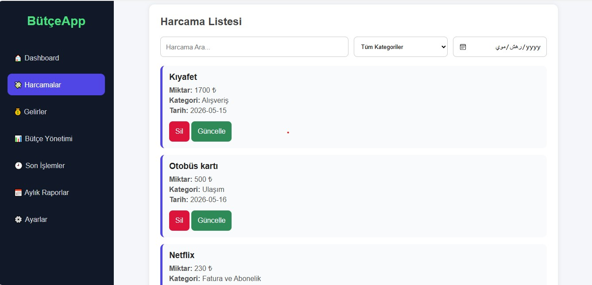
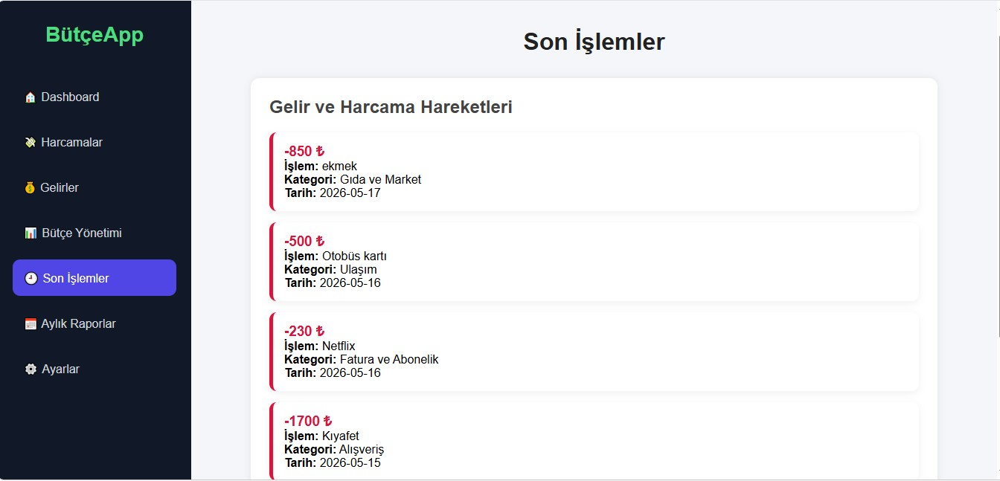

# Kişisel Bütçe ve Harcama Takip Sistemi

Bu proje, Sistem Analizi ve Tasarımı dersi kapsamında geliştirilmiş kişisel bütçe ve harcama takip uygulamasıdır.

## Proje Amacı

Kullanıcıların:

- gelirlerini takip etmesi
- harcamalarını yönetmesi
- bütçe planlaması yapması
- aylık raporları görüntülemesi

amaçlanmıştır.

---

# Kullanılan Teknolojiler

## Frontend
- HTML5
- CSS3
- JavaScript

## Backend
- Node.js
- Express.js

## Veritabanı
- SQLite

## Diğer Teknolojiler
- Swagger UI
- Nodemon
- LocalStorage

---

# Özellikler

## Dashboard
- Toplam gelir görüntüleme
- Toplam harcama görüntüleme
- Kalan bakiye hesaplama
- Bütçe durumu gösterimi

## Harcama Yönetimi
- Harcama ekleme
- Harcama güncelleme
- Harcama silme
- Kategori filtreleme
- Tarih filtreleme
- Harcama arama

## Gelir Yönetimi
- Gelir ekleme
- Gelir silme
- Gelir listesi görüntüleme

## Bütçe Yönetimi
- Aylık bütçe limiti belirleme
- Bütçe aşımı kontrolü

## Son İşlemler
- Son gelir ve gider hareketleri

## Aylık Raporlar
- Aylık gelir hesaplama
- Aylık gider hesaplama
- En çok harcama yapılan kategori

## Ayarlar
- Dark mode desteği
- Kullanıcı adı değiştirme
- Tüm verileri temizleme

---

# Kurulum

## Projeyi klonlama

```bash
git clone https://github.com/rewakasem13-lab/KisiselButceVeHarcamaTakipSistemi.git
```

## Backend kurulumu

```bash
cd backend
npm install
npm run dev
```

## Frontend çalıştırma

Frontend kısmı Live Server eklentisi ile çalıştırılabilir.

---

# Swagger API Dokümantasyonu

Uygulama çalışırken:

```text
http://localhost:3000/api-docs
```

adresinden API dokümantasyonuna erişilebilir.

---

# API Endpointleri

## Harcamalar
- GET /harcamalar
- POST /harcamalar
- PUT /harcamalar/:id
- DELETE /harcamalar/:id

## Gelirler
- GET /gelirler
- POST /gelirler
- DELETE /gelirler/:id

---

# Geliştirici

Rewa Kasem

---

# Ders

Sistem Analizi ve Tasarımı

---

# Ekran Görüntüleri

## Dashboard


---

## Harcamalar


---

## Harcama Detayları



---

## Gelirler


---

## Bütçe Yönetimi


---

## Son İşlemler



---

## Aylık Raporlar


---

## Ayarlar


